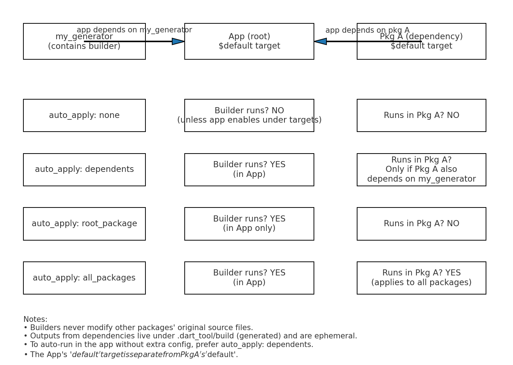

#################################################
Inside the build.yaml there are 2 main sections targets and builders

targets are optional if you want to specifically define these builders should run on these directories you can define the targets in your consumer application. It is just for defining these builders need to run on these directories or packages. In short terms you are defining in this package run on these builders on these sources (source files)

>NOTE: targets has no effect outside the package it is defined in. each package and application in dart has its own targets. so in short targets section can only have effects on files and directories of the package it is defined in. In short targets section is per package.

NOTE: To define the scope of files of consumer apps that depend on our generator library it should be defined in the builders section, generally by defining the `auto_apply` scope. 

here is some example:

```yaml
targets:
  $default:
    sources:
      - lib/**
      - pubspec.yaml
    builders:
      my_generator|my_builder:
        enabled: true
```
we can define multiple targets inside the targets section
By default behind the scenes we already have a targets like below if in our top level builders section we have a builder defined.

```yaml
targets:
  $default:
    builders:
      my_builder:
        enabled: true
```

Here is a more complex version of a build.yaml file with only targets section create in an application that wants different builders from other libraries to be run on certain files inside the application files 

```yaml
# build.yaml (in your application package)

targets:
  $default:
    # Tell build_runner which files in THIS package are considered inputs.
    sources:
      - lib/**
      - pubspec.yaml
      - README.md

    builders:
      # 1) Run Builder A (from the first library) ONLY on pubspec.yaml and README.md
      first_library_package_name|first_builder_factory_method_name:
        enabled: true         # keep if that builder didn't set auto_apply
        generate_for:
          - pubspec.yaml
          - README.md

      # 2) Run Builder B (from the second library) on everything inside lib/
      second_library_package_name|second_builder_factory_method_name:
        enabled: true         # keep if that builder didn't set auto_apply
        generate_for:
          - lib/**

```

#### The dependencies property

the dependencies property inside a targets: section is one of the lesser-known build_runner features.
Here’s the simple version:

##### What it does
By default, a target’s builders can only read files inside that target (its own package).

If you add dependencies: to a target, you’re telling build_runner:
“This target is also allowed to read files from these other targets (other packages).”
This is read-only access — it lets your builders use outputs or inputs from other packages, but it does not let you modify those packages.

##### Simple example
Let's say you have:

```graphql
my_app/
my_generator/    # contains a builder that needs to read schema files from another package
shared_schemas/  # contains YAML schema files
```

Your app (my_app) depends on both my_generator and shared_schemas.

By default, if a builder in my_app tries to read shared_schemas/lib/foo.yaml, build_runner will block it — `not part of this target.`

But if you add:

```yaml
# my_app/build.yaml
targets:
  $default:
    dependencies:
      - shared_schemas
```

Now builders running in my_app are allowed to read files from shared_schemas during the build.

Why it's used
To aggregate or combine files from other packages (e.g., docs, configs, templates).

To make a builder that merges outputs from multiple packages into one final output in the app.

For multi-package code generation in a mono-repo.

#### auto_apply

Now we should also mention `auto_apply`:

inside the builders section when defining builders there is a field called auto_apply, which defines a general scope for the files this builder should run on when added to an application as library.

```yaml
builders:
  flutter_gen_runner:
    import: 'package:flutter_gen_runner/flutter_gen_runner.dart'
    builder_factories: ['build']
    build_extensions: { '$package$': ['.gen.dart'] }
    auto_apply: dependents
    build_to: source
```

`auto_apply` Takes 4 value, `none, dependents, root_package, all_packages`

auto_apply tells when your builder should automatically run in other packages without the developer explicitly enabling it in their build.yaml.

Values:

The four possible values
1️⃣ none
Meaning: Don’t run my builder unless the developer manually enables it in their build.yaml under targets:.

In an app using your library:
Your builder does nothing unless the app’s developer explicitly turns it on.

2️⃣ dependents ✅ (most common for generators)
Meaning: Run my builder in any package that depends on my package (either directly or indirectly).

In an app using your library:
As soon as the app adds your package to dependencies, your builder runs automatically on the app’s $default target without them adding anything to their build.yaml.

3️⃣ root_package
Meaning: Only run my builder in the root package being built — usually the app.

In an app using your library:
Your builder runs only in the main app package, not in any other packages the app depends on (even if those packages depend on your library).

4️⃣ all_packages
Meaning: Run my builder in every package in the build graph — your own library, the app, and all other dependencies.

In an app using your library:
Your builder runs everywhere — the app, your library, and any other package in the dependency tree.

Rarely used because it’s heavy and can slow builds.

> NOTE: as explained above the the developers can explicitly define where the builders from our package should run in their project by defining a targets section inside the build.yaml in their project

| `auto_apply` value | Runs in the app automatically? | Runs in other packages in the dependency tree? | Needs config in app’s build.yaml? |
| ------------------ | ------------------------------ | ---------------------------------------------- | --------------------------------- |
| `none`             | ❌ No                           | ❌ No                                           | ✅ Yes, must be enabled manually   |
| `dependents`       | ✅ Yes                          | ✅ Yes (if they depend on your lib)             | ❌ No                              |
| `root_package`     | ✅ Yes                          | ❌ No                                           | ❌ No                              |
| `all_packages`     | ✅ Yes                          | ✅ Yes (everywhere)                             | ❌ No                              |

**Here is a diagram:**



> “Does that change other libraries’ source code?”
No. Builders never edit original source files in other packages.
>
> For dependencies, any outputs are placed under .dart_tool/build/generated/<package>/... (ephemeral build outputs).
>
> Your builder might generate helpers/extensions for those packages during the build, but it doesn’t rewrite their checked-in code.
>
> Only the app’s own project files might see generated files next to them if your builder uses build_to: source (e.g., *.g.dart). Dependencies from pub/path don’t get their source trees mutated.

Summary

#### Mental model
- Builders = 'what to run' (defined by the generator author; can auto-apply to dependents).

- Targets = 'where to run it in this package' (chosen by the package being built).

- \$default exists in every package (the app's \$default is not the same as your library's $default).

#### TL;DR
- Your library's targets: does not control the app.

- Use builders: + auto_apply: dependents to make your builder run in apps by default.

- The app's \$default target is what build_runner uses when building the app.

## Builders

#### options

Alright — here’s how release options work in build.yaml and how to trigger them.

**1. What release_options is for**
In a builder definition, you can have different configuration sets depending on the build mode:

```yaml
builders:
  my_builder:
    import: "package:my_generator/builder.dart"
    builder_factories: ["myBuilder"]
    build_extensions: { ".dart": [".g.dart"] }
    build_to: source
    auto_apply: dependents
    defaults:
      options:            # <--- normal dev options
        minify: false
    release_options:      # <--- overrides for release builds
      minify: true
```
When you run in release mode, the release_options values override options.

**2. How to trigger a release build**
The default dart run build_runner build runs in development mode.

To use release_options, you must pass:
`dart run build_runner build --release`

**3. What happens**
build_runner sets the build environment to ReleaseBuildOptions.
Your builder sees options overridden by whatever is inside release_options.

Example: if minify was false in dev but true in release, your generator code will get true when reading the option in release mode.

**4. Common use cases**
- Turn off expensive debug logging in generated code
- Enable minification / obfuscation
- Change generated constants (e.g., API base URLs) for production

5. In your generator code
You read these values from the BuilderOptions your factory gets:

```dart
Builder myBuilder(BuilderOptions options) {
  final minify = options.config['minify'] as bool? ?? false;
  // Use minify flag in your generator logic...
}
```

#### How developers should configure options
It depends entirely on how they run build_runner in their app.

**1. If they just run:**
`dart run build_runner build`
or
`dart run build_runner watch`

➡ Your builder will use the defaults.options from your build.yaml (the “dev” options).
These are the same whether it’s the app or your own package running it — this is just the normal development mode.

**2. If they run with --release:**
`dart run build_runner build --release`

➡ Your builder will use the release_options from your build.yaml.
Those values override anything in defaults.options.

**3. Can they override these in their own app?**
Yes — the app can put its own build.yaml with global_options: or targets: to override both dev and release settings for your builder, for example:
```yaml
global_options:
  my_generator|my_builder:
    options:
      minify: false
    release_options:
      minify: true
```

This takes precedence over what you define in your library's build.yaml.

> When the app is the root package being built:
> `auto_apply: dependents` makes your builder run in the app's $default target automatically.
> Which options are applied (dev or release) depends only on whether the app runs build_runner with or without --release.


